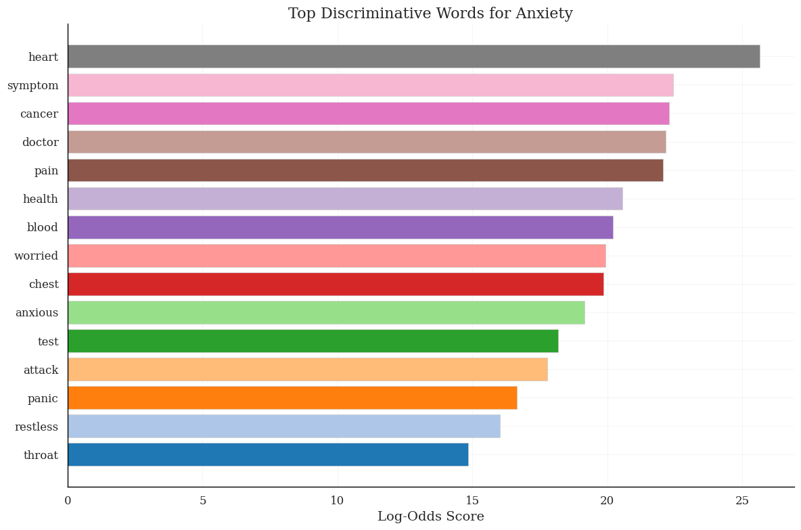
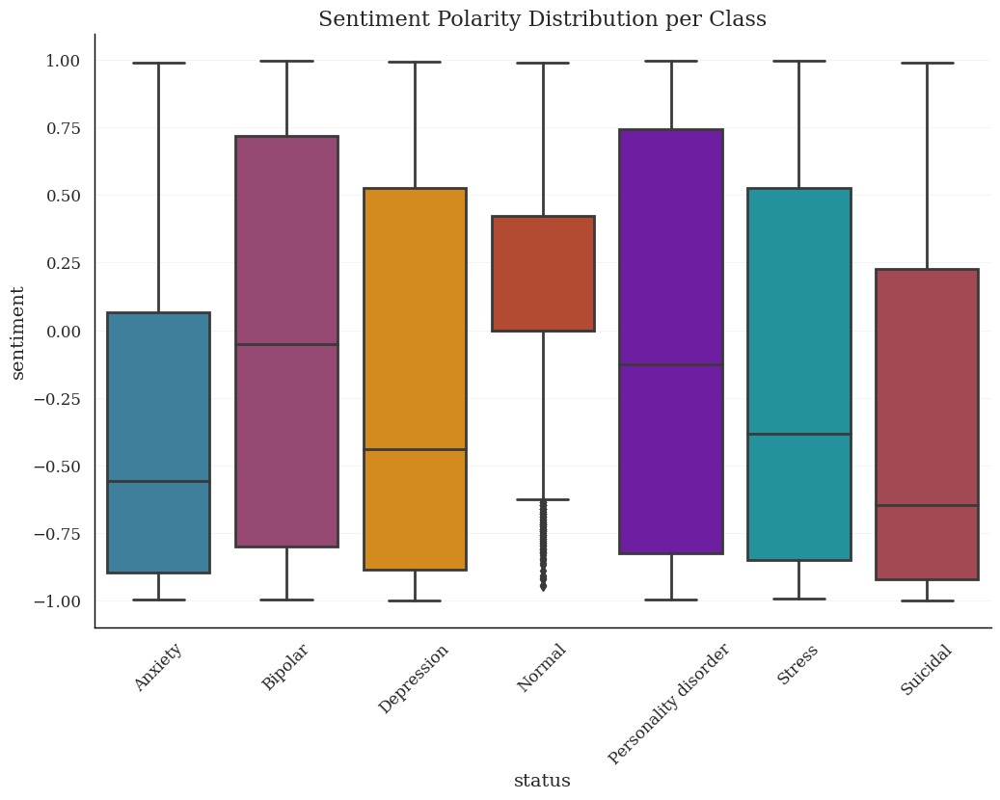
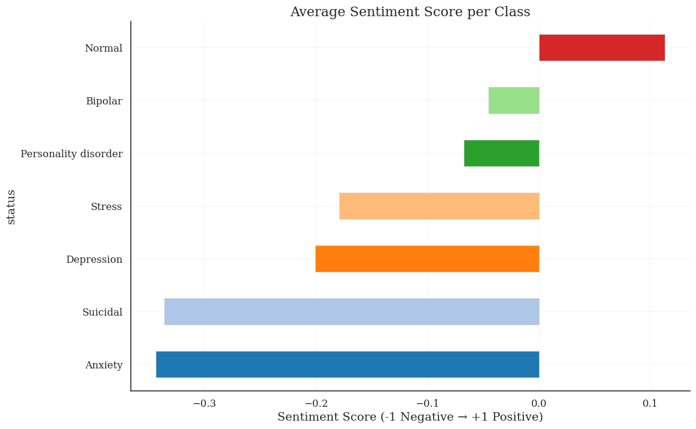
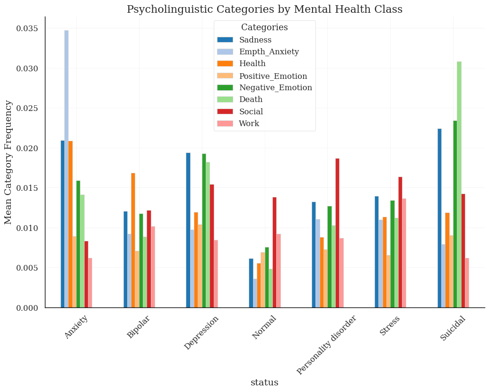
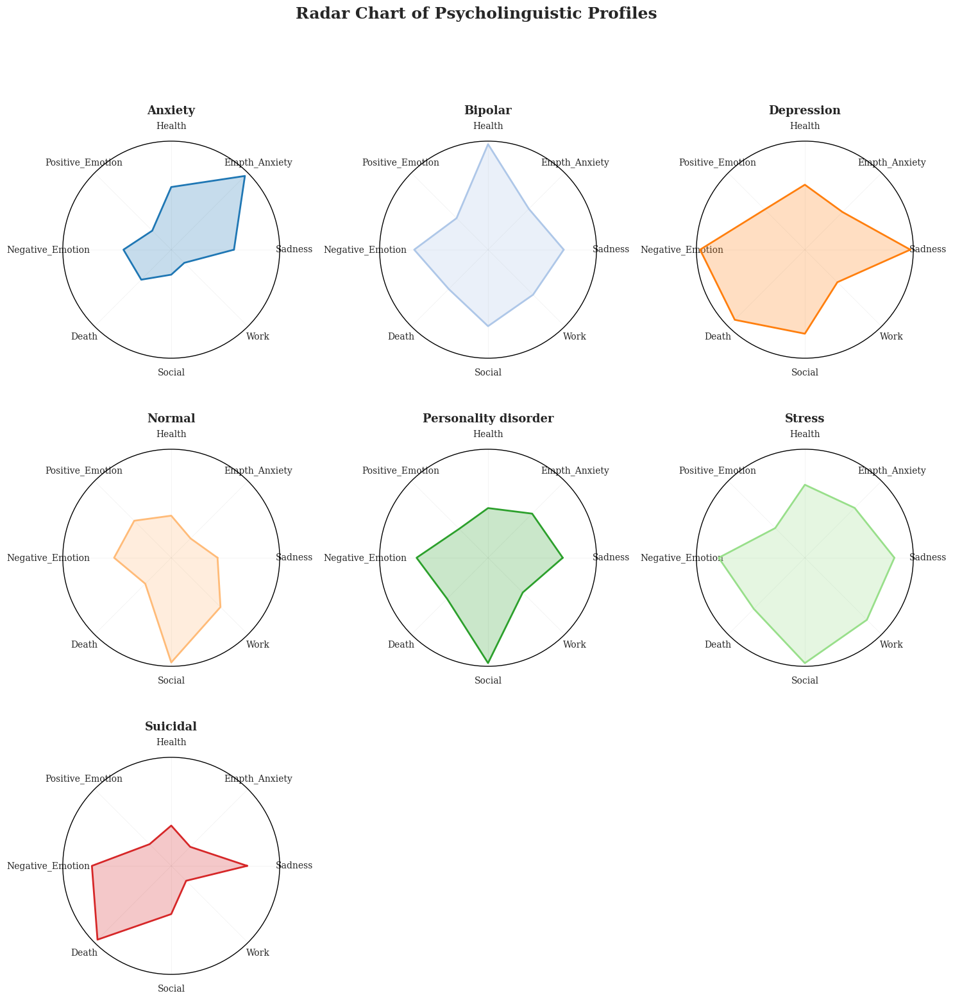
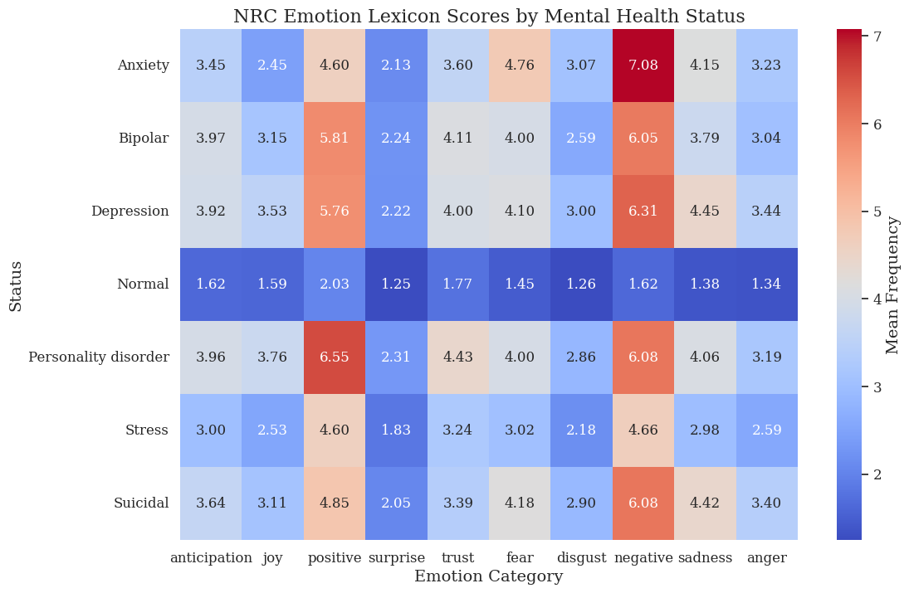

## Ayesha Saleem
ayeshasaleem853@gmail.com

## Title: Psycholinguistic and Emotion-Centric Analysis of Mental Health Text: An Exploratory Study of Discriminative Linguistic Markers

## Abstract
This study investigates whether mental health status can be inferred from linguistic patterns in social media text. Emphasis is placed on interpretability: identifying discriminative words, sentiment polarity, and psycholinguistic categories that differentiate mental health conditions. Using a curated dataset of social-media posts, we apply text cleaning, sampling, lexical and distributional analyses, log-odds ratio for discriminative keyword detection, sentiment scoring with VADER, and psycholinguistic profiling using Empath and the NRC emotion lexicon. Results highlight distinct lexical and emotional signatures across conditions and suggest avenues for interpretable classification and clinical insight. 

## 1. Introduction
Understanding how language reflects mental health states is important for early detection, research, and potential clinical applications. Prior work focused primarily on predictive performance. This study prioritizes interpretability and exploratory analysis to surface language features that are both statistically discriminative and clinically meaningful. The main contributions are: (1) a reproducible exploratory pipeline for cleaning and sampling social-media text; (2) an interpretable discriminative keyword analysis using log-odds with an informative prior; (3) combined sentiment and psycholinguistic profiling across mental health classes.

## 2. Data
The analysis uses a dataset of social-media posts labeled by mental health status. The dataset is publically available on [Kaggle](https://www.kaggle.com/datasets/suchintikasarkar/sentiment-analysis-for-mental-health). 

## 3. Preprocessing
Text preprocessing was performed to improve signal quality and interpretability. Steps included:
- Expand contractions.
- Normalize to lowercase and retain only alphabetic characters and spaces.
- Tokenize and remove stopwords, a small domain-specific stopword list (e.g., common filler words), and label tokens that coincide with class labels.
- Lemmatize tokens using WordNet.
After preprocessing, each post is represented as a cleaned statement and grouped by class to produce aggregated text for class-level analyses.

## 4. Sampling and outlier handling
To reduce computational cost and avoid distortion from extreme length posts, posts were filtered by statement length using the interquartile range method. From the filtered corpus a stratified random sample of at most 2,000 posts per status class was drawn. This sampling strategy preserves class diversity while enabling fast exploratory computation.

## 5. Exploratory linguistic analyses
### 5.1 Frequency and visualization
Word clouds and horizontal bar charts were used to summarize frequent tokens for each class. These visualizations expose common themes but do not account for class specificity.

### 5.2 Discriminative keywords via log-odds ratio with Dirichlet prior
To identify terms that are strongly associated with a particular class relative to others we compute the log-odds ratio with an informative Dirichlet prior. For each class c and token t, the method computes a normalized log-odds score and an associated variance estimate that yields a z-like score. Tokens with the highest positive scores for a class are interpreted as discriminative of that class. The implementation accounts for vocabulary size and small-sample smoothing.

[Figure: Top Discriminative Words for Anxietys]

## 6. Sentiment analysis
Sentiment polarity was computed at the statement level using VADER. Each cleaned statement is assigned a compound sentiment score in the range [-1, +1]. Class-level distributions were visualized with boxplots and mean sentiment per class was plotted to compare tonal differences across statuses. Notable patterns include more negative median sentiment for classes such as Depression and Anxiety and more neutral-to-positive sentiment for the Normal class.

[Figure: Sentiment polarity boxplots by class]

[Figure: Average sentiment per class]

## 7. Psycholinguistic and emotion lexicon analysis
### 7.1 Empath categories
Empath was used to map statements to psycholinguistic categories such as cognition, health, social, and emotion-related categories. Category means by class provide a profile of dominant semantic themes per status.
Psycholinguistic categories by status:

[Figure: Psycholinguistic categories by Mental Health Status]

[Figure: Radarchart of Psycholinguistic Profiles]

 

### 7.2 NRC emotion lexicon
The NRC Emotion Lexicon (via NRCLex) was applied to generate emotion frequency scores (for example, sadness, joy, anger, fear) per statement. Class-level mean emotion scores were visualized with heatmaps and radar charts to show distinctive emotion profiles.

[Figure: NRC emotion lexicon heatmap]

## 8. Results
- Discriminative keywords: The log-odds analysis surfaces tokens that are class-specific and often align with clinical signals (for example, terms associated with hopelessness, sleep, or panic in relevant classes). The top tokens per class are presented in the figures.
- Sentiment polarity: On average, classes associated with clinical conditions show lower compound sentiment scores than the Normal class. Some classes (for example, Bipolar or Personality disorder) exhibit higher variance in sentiment.
- Psycholinguistic profiles: Empath categories and NRC emotion scores show meaningful differences across classes. Categories associated with negative affect and health concerns are relatively elevated in clinical classes.

## 9. Limitations
- The dataset origin and annotation process impose unknown biases that may affect generalizability.
- The analysis uses a sampled subset of the data for computational tractability; results could shift with different sampling strategies or the full dataset.
- Lexicon-based methods have limitations: they may not capture sarcasm, context-dependent meanings, or complex discourse-level features.
- Ethical considerations: automated detection of mental health states raises privacy and misuse concerns and requires careful governance.

## 10. Conclusion
This exploratory study outlines an interpretable workflow for examining psycholinguistic and emotional markers in mental health-related social-media text. The combined use of discriminative keyword analysis, sentiment scoring, and psycholinguistic profiling reveals class-specific language signals that are useful for both research and interpretable modeling.

--- 

#### How to cite

If you use this work in academic research, please cite it as follows:

Saleem, A. (2025). Psycholinguistic and Emotion-Centric Analysis of Mental Health Text: An Exploratory Study of Discriminative Linguistic Markers. Code available at: https://github.com/aysh34/Psycholinguistic-Patterns-and-Emotional-Markers-in-Mental-Health